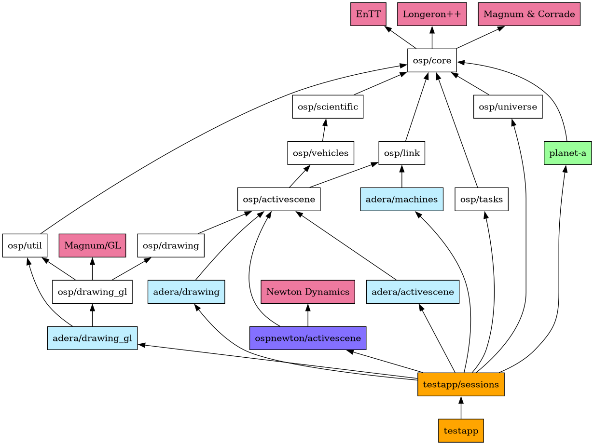

# Architecture

Welcome aboard! This document presents a high level overview of the project, aiming to provide an initial understanding of the codebase.

**Table of Contents**
<!-- TOC start (generated with https://github.com/derlin/bitdowntoc) -->

- [Directories](#directories)
- [Philosophy](#philosophy)
   * [Non-OOP approach](#non-oop-approach)
- [Testapp code](#testapp-code)
   * [Top Tasks, Top Data, and Pipelines](#top-tasks-top-data-and-pipelines)
   * [Sessions and scenarios](#sessions-and-scenarios)

<!-- TOC end -->


## Directories


*osp-magnum ./src folder dependency graph between major components. Components depend on each other by `#include`-ing header files of another component.*

Legend:

* Light Blue - `src/osp` subdirectory. 'Main fundemental core stuff' library
* Dark Blue - Other subdirectories / libraries that are ours.
* Purple - External Libraries. Not our code.

Important notes:

* `osp/core` contains basic C++ stuff: containers, math, and utilities. Nothing space-related.
* [Magnum](https://github.com/mosra/magnum) (and its utility library Corrade) is used for their math and containers (i.e.: `Vector3` and `ArrayView`). Its OpenGL features are used only by `*_drawing_gl` and `testapp`.
* [EnTT](https://github.com/skypjack/entt/) is used for metaprogramming and containers. Its Entity-Component-System features (specifically entt::registry) are not used; they were used in OSP in the past, but the codebase has moved on since then.
* [Longeron++](https://github.com/Capital-Asterisk/longeronpp) Core components of OSP, but the BDFL decided to move them into a separate library.
* `osp/util` contains bigger (mostly self-contained) components that are intended for an application (not a library). So far this contains logging and user input processing.
* `osp/activescene` is your typical game engine 'scene graph'. This represents a 3D world of entities (ActiveEnt) that can be parented to each other and have physical properties.
* `osp/drawing` describes a set of entities (DrawEnt) that can be drawn; not specific to any rendering backend. (i.e.: A 'green cube' can be represented with DrawEnts, and it's up to whatever rendering backend we use to interpret that).
* `planet-a` generates planet terrain meshs. This code creates plain arrays of vertices and indices that are *intended* to be loaded into the physics engine or GPU, but doesn't have any of its own code for that.
* `ospjolt` integrates [Jolt Physics](https://github.com/jrouwe/JoltPhysics) to use as a rigid body physics engine for `osp/activescene`.
* `adera` is for fun stuff. More gameplay and visual-effects focused.
* `adera_app` gathers together many different components and uses `osp/framework` to package them into composable 'Features' to be used in an application.
* `src/testapp` sits at the top as a runnable application. Assembles everything to make test scenarios.

## Philosophy

One of the key ideas is that the engine is architected in such a way that there's no 'random-access'.

In a typical game engine approach, a game world is roughly represented by a bunch of objects that talk to each other with scripts and/or events. Code for a rocket engine would resemble something like this:
```
function on_update():
    drain_fuel()
    apply_physics_thrust()
    play_sounds()
    make_particle_effects()
```

As of now, this is the status quo in game dev, but it's rather problematic; mostly because these are unrelated tasks coupled together.


* This is bugprone and difficult to debug.
  * Values are changed anywhere at any time, unpredictably.
  * If we're doing things like adding and removing objects, we'll get NullReferenceException everywhere :)
* This is the worst kind of structure to multithread.
  * You'd have to use a bunch of ugly mutexes and the threads would have to wait for each other.
* It's not easy to enable/disable different behaviours.
  * Sounds and particle effects are not needed when running on a dedicated server or in the background.
  * Adding new behaviours often requires modifying the original function


Fixing this is not just a matter of separating these into different scripts or using some composition based system. We'd have to completely rethink how data within objects are updated.


We'd want a scheme where each function works on batches of multiple objects. We must be able to predict exactly which regions of memory each task reads from, and which regions they modify.

We can achieve this by writing functions that run in top level of the code, controlling everything below it:
```
function on_world_update():
    drain_fuel(allRockets, allFuelTanks)              // Modifies both rockets and fuel tanks
    apply_physics_thrust(allRockets, physicsEngine)   // Reads rockets, writes to Physics engine
    play_sounds(allRockets, soundSystem)              // Reads rockets, writes to Sound engine
    make_particle_effects(allRockets, particleSystem) // Reads rockets, writes to Particle system
```

* We know exactly when values are modified at all times
* apply_physics_thrust, play_sounds, and make_particle_effects don't modify the same data. This means they can be easily multithreaded and run in parallel.
* Features are easier to manage from the top, instead of being the responsibility of individual objects


Communication between components is achieved by sharing variables. One function writes to a value, then another function reads from it.


These ideas are identical to Data-oriented design and Entity Component System, but without needing entities and components specifically.


OSP takes these further, adding a task system to effectively compose together tasks and functions at setup/runtime, and assign dependencies between them. These unconventional techniques were heavily iterated over the years, and are needed to tackle rocket-science level complexity in the simplest way possible, while being blazingly fast.


### Non-OOP approach


OSP has minimal use of 'objects'. Don't expect to find a 'rocket class' anywhere. Most instances are represented by an integer ID (first instance starts at ID=0, next is 1, 2, 3, etc...). Deleted IDs are reused. Data is assigned to IDs by using them as array indices or keys to containers.

```cpp

// From src/osp/activescene/active_ent.h
// Defines an integer ID for 'Active Entity'. This is used as nodes in a scene graph hierarchy for physics and rendering.
using ActiveEnt = StrongId<uint32_t, struct DummyForActiveEnt>;

// From src/osp/activescene/basic.h
struct ACtxBasic
{
    // Keeps track of which ActiveEnts exist. Use this to create and delete ActiveEnts
    lgrn::IdRegistryStl<ActiveEnt>      m_activeIds;

    // Stores parent/child relationships between ActiveEnts
    ACtxSceneGraph                      m_scnGraph;

    // Container from the EnTT library that optionally associates ActiveEnts with a Magnum Matrix4
    // Roughly equivalent in functionality to std::map<ActiveEnt, Matrix4>
    ACompTransformStorage_t             m_transform;
}
```

Also expect almost every type in OSP to just be a bunch of std::vectors on the inside.

One strong advantage of using IDs / array indices is that sets of objects (like `std::set<ActiveEnt>`) can be very efficiently represented by a BitVector. A handful of bytes can very efficiently represent a set of a couple thousand objects, and is fast to iterate. BitVectors are often used for dirty flags (list of which instances need to be updated) here and there.

Since the BDFL uses the same techniques for different projects, this functionality has been split into a separate library, Longeron++ https://github.com/Capital-Asterisk/longeronpp

## Testapp code

Everything in `src/osp` is practically a library. `src/testapp` is the application that uses this library to make the test scenarios.

### Top Tasks, Top Data, and Pipelines

`src/testapp/testapp.h` features `TestApp` and `TestAppTasks`. This is stored in main.cpp as `g_testApp`. `TestAppTasks` holds "TopData" and "TopTasks". TopData refers to an std::vector of arbitrary types that can be indexed to with a TopDataId, and are passed to TopTasks as function arguments. Tasks set dependencies between each other based on how they read/write to certain variables. Not going too in depth with this for now, but variables are roughly associated with a "Pipeline" containing "Stages" that Top Tasks can 'sync' to. This allows an executor to know which tasks to run in series or parallel (only a single threaded executor is implemented for now).

eg: A queue variable can be associated with a pipeline with stages \[Write,Read,Clear\]. Task A syncs with Write, Task B syncs with Read, Task C syncs with Clear. An executable would now know to run these tasks in series A -> B -> C.

there's a few other capabilities in there that allow it to do a main loop effectively.

### Sessions and scenarios

The test scenarios are composed by throwing together tasks, data, and pipelines. Groups of tasks, data, and pipelines that support a single 'feature' are referred to as a `Session`. `testapp/scenarios.cpp` calls a whole bunch of `setup_*` functions that each create sessions.

A simple example of what these do is the dropper session:  `testapp/sessions/shapes.cpp setup_droppers(builder, rTopData, scene, commonScene, physShapes)`

This session depends on data from the commonScene session and physShapes session. It adds floats as TopData to use as timers, and adds tasks to increment the timers and spawn shapes.


