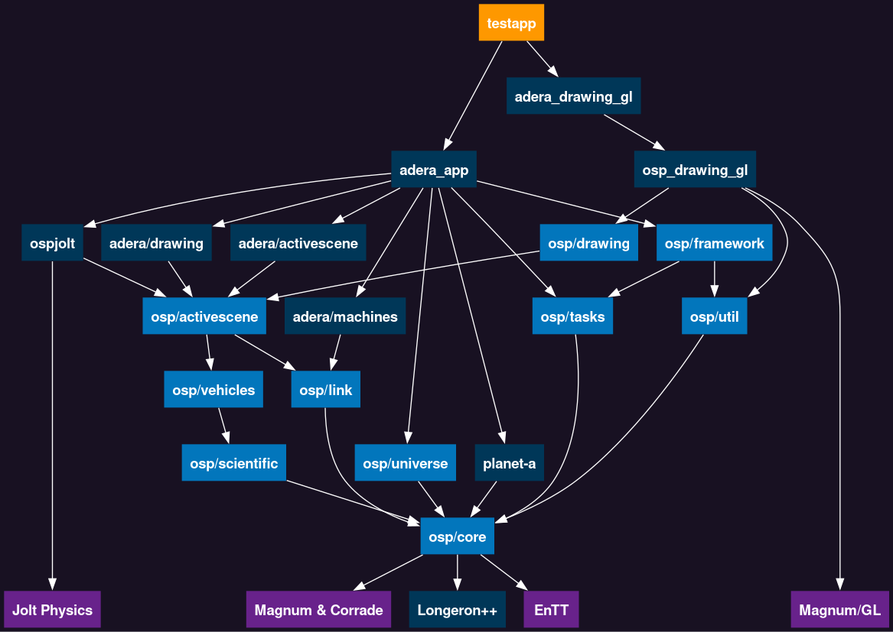

# Architecture

Welcome aboard! This document presents a high level overview of the project, aiming to provide an initial understanding of the codebase.

**Table of Contents**
<!-- TOC start (generated with https://github.com/derlin/bitdowntoc) -->

- [What to expect?](#what-to-expect)
- [Directories](#directories)
- [Philosophy](#philosophy)
   * [Avoiding 'objects and scripts'](#avoiding-objects-and-scripts)
   * ['Non-OOP' ways of representing objects](#non-oop-ways-of-representing-objects)
- [Testapp code](#testapp-code)

<!-- TOC end -->


## What to expect?

The codebase is a bit strange and unconventional, but everything is there for a reason.

* Code tends to be divided based on dependencies and different aspects of what a single 'object' does. Not many 'big objects'. Low use of inheritance and virtual functions.
  * 'rocket' will be split into "rocket wiring" in one place, "rocket jolt physics" near jolt physics code, then "rocket thrust indicator" somewhere else.
  * No single 'planet mesh' class. `src/planet-a/skeleton.h` stores relationships between vertices in a mesh, but XYZ position data is in `src/planet-a/geometry.h` and math is in `src/planet-a/icosahedron.h`
* Heavy use of integer IDs everywhere.
* Almost everything is just structs of std::vector
* Big complicated metaprogramming probably just outputs a simple struct at the end.
* Researching buzzwords is frustrating or misleading. Don't think about them too much.
  * 'modern', 'entity-component-system', 'data-oriented design', 'data-driven', whatever-driven development.... what do these mean??? Every source says something different??
  * Best to look at the docs or what the code actually does, which can be described in plain languge.

*BDFL note: I'm not sure what most people coming to this project are familiar with. Feel free to edit this section.*


## Directories


*osp-magnum ./src folder dependency graph between major components. Components depend on each other by `#include`-ing header files of another component.*

Legend:

* Light Blue - `src/osp` subdirectory. 'Main fundemental core stuff' library
* Dark Blue - Other subdirectories / libraries that are ours.
* Purple - External Libraries. Not our code.

Important notes:

* `osp/core` contains basic C++ stuff: containers, math, and utilities. Nothing space-related.
* [Magnum](https://github.com/mosra/magnum) (and its utility library Corrade) is used for their math and containers (i.e.: `Vector3` and `ArrayView`). Its OpenGL features are used only by `*_drawing_gl` and `testapp`.
* [EnTT](https://github.com/skypjack/entt/) is used for metaprogramming and containers. Its Entity-Component-System features (specifically entt::registry) are not used; they were used in OSP in the past, but the codebase has moved on since then.
* [Longeron++](https://github.com/Capital-Asterisk/longeronpp) Core components of OSP, but the BDFL decided to move them into a separate library.
* `osp/util` contains bigger (mostly self-contained) components that are intended for an application (not a library). So far this contains logging and user input processing.
* `osp/activescene` is your typical game engine 'scene graph'. This represents a 3D world of entities (ActiveEnt) that can be parented to each other and have physical properties.
* `osp/drawing` describes a set of entities (DrawEnt) that can be drawn; not specific to any rendering backend. (i.e.: A 'green cube' can be represented with DrawEnts, and it's up to whatever rendering backend we use to interpret that).
* `planet-a` generates planet terrain meshs. This code creates plain arrays of vertices and indices that are *intended* to be loaded into the physics engine or GPU, but doesn't have any of its own code for that.
* `ospjolt` integrates [Jolt Physics](https://github.com/jrouwe/JoltPhysics) to use as a rigid body physics engine for `osp/activescene`.
* `adera` is for fun stuff. More gameplay and visual-effects focused.
* `adera_app` gathers together many different components and uses `osp/framework` to package them into composable 'Features' to be used in an application.
* `src/testapp` sits at the top as a runnable application. Assembles everything to make test scenarios.

## Philosophy

Simply build everything as separate libraries, then connect them together. This allows picking the best data structures and algorithms required for each job. Components aren't forced to depend on a central object system or even update functions (unlike in some conventional game engines).

For example, an orbit simulator should be able to arrange its own arrays and buffers for the most efficient memory layout.

To connect components together, the OSP 'framework' provides ways to arrange tasks in the main loop and define dependencies between them. This ensures that tasks are run in the correct order (or possibly even in parallel, but this is not yet implemented).

### Avoiding 'objects and scripts'

In a conventional game engine, a game world is roughly represented by a bunch of objects that talk to each other with scripts and/or events. For example, code for a 'rocket engine' would resemble something like this:
```
function on_update():
    drain_fuel()
    apply_physics_thrust()
    play_sounds()
    make_particle_effects()
```

As of now, this is the status quo in game dev, but it's problematic; mostly because these are unrelated tasks coupled together.

* Everything can modify anything, anytime.
  * This is bugprone and difficult to debug.
  * Systems need to be designed to handle random modifications, increasing complexity.
  * If we're doing things like adding and removing objects, we'll get NullReferenceException everywhere :)
* This is the worst kind of structure to multithread.
  * You'd have to use a bunch of ugly mutexes and the threads would have to wait for each other.
* It's not easy to enable/disable different behaviours.
  * Sounds and particle effects are not needed when running on a dedicated server or in the background.
  * Adding new behaviours often requires modifying the original function

Fixing this is not just a matter of separating these into different scripts or using some composition based system. We'd have to completely rethink how data within objects are updated.

We'd want a scheme where each function works on batches of multiple objects. We must be able to predict exactly which regions of memory each task reads from, and which regions they modify.

We can achieve this by writing functions that run in top-level of the code, controlling everything below it:
```
function on_world_update():
    drain_fuel(allRockets, allFuelTanks)              // Modifies both rockets and fuel tanks
    apply_physics_thrust(allRockets, physicsEngine)   // Reads rockets, writes to Physics engine
    play_sounds(allRockets, soundSystem)              // Reads rockets, writes to Sound engine
    make_particle_effects(allRockets, particleSystem) // Reads rockets, writes to Particle system
```

* We know exactly when values are modified at all times
* apply_physics_thrust, play_sounds, and make_particle_effects don't modify the same data. This means they can be easily multi-threaded and run in parallel.
* Features are easier to manage from the top, instead of being the responsibility of individual objects
* Communication between components is achieved by sharing variables. One function writes to a value, then another function reads from it.
* These ideas are identical to Data-oriented design and Entity Component System, but without being constrained to only entities and components.

Each one of these top-level functions can be made into a 'Task' using OSP framework. Tasks and their relevant data can then be packaged into 'Features' to easily enable, disable, and set dependencies between major components.


### 'Non-OOP' ways of representing objects

OSP has minimal use of 'objects'. Don't expect to find a 'rocket class' or 'rocket script' anywhere. Most instances are represented by an integer ID (first instance starts at ID=0, next is 1, 2, 3, etc...). Deleted IDs are reused. Data is assigned to IDs by using them as array indices or keys to containers.

```cpp

// From src/osp/activescene/active_ent.h
// Defines an integer ID for 'Active Entity'. This is used as nodes in a scene graph hierarchy for physics and rendering.
// Internally, this is just a single integer
using ActiveEnt = StrongId<std::uint32_t, struct DummyForActiveEnt>;

// From src/osp/activescene/basic.h
struct ACtxBasic
{
    // Keeps track of which ActiveEnts are taken or free. Use this to create and delete ActiveEnts
    lgrn::IdRegistryStl<ActiveEnt>      m_activeIds;

    // Stores parent/child relationships between ActiveEnts
    ACtxSceneGraph                      m_scnGraph;

    // Container from the EnTT library that optionally associates ActiveEnts with a Magnum Matrix4
    // Roughly equivalent in functionality to std::map<ActiveEnt, Matrix4>
    ACompTransformStorage_t             m_transform;
}
```

A strong advantage of using IDs / array indices is that a bit vectors (array of unsigned integers) can efficiently represent a sorted set of unique integers (similar to `std::set<int>`). `lgrn::IdRegistryStl` uses a bit vector internally. `lgrn::IdSetStl<IdType>` can be used as a drop-in replacement for `std::set<IdType>` for IDs.

Since the BDFL uses the same techniques for different projects, this functionality has been split into a separate library, Longeron++ https://github.com/Capital-Asterisk/longeronpp


## Testapp code

`src/testapp` uses the rest of OSP as a library to make playable test scenarios.

Most of 'everything that happens' is contained within an `Framework` instance in `src/testapp/main.cpp`.

TestApp implements a renderer using Magnum's OpenGL features. Most of OSP uses the Magnum library for other utilities, but all 'rendering' code is in TestApp, `src/osp_drawing_gl`, and `src/adera_drawing_gl`.
