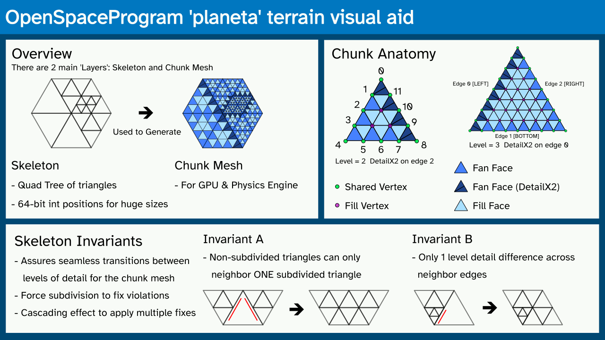

# Terrain module: planeta


This document is intended for developers working with the planeta module in `src/planet-a`.



*infographic showing a basic overview of the skeleton, chunks, terminology, and invariants*


## Introduction

Planets are big <sup>\[citation needed\]</sup>. We can't represent entire planets in full detail all in one mesh. We need some sort of "level-of-detail" system to subdivide a mesh on-the-fly as a viewer moves across the surface.

### Skeleton

The Earth is about 6,371km in radius. When trying to represent Earth with a conventional single-precision floating point mesh, surface detail will be limited down to 0.5 meters:

* `6371000.0f` + `0.1f` = `6371000.0f`
* `6371000.0f` + `0.26f` = `6371000.5f`

Floats (and also doubles) struggle with large values far from zero. This makes any other intermediate calculations difficult too, not just the final surface detail. Now also consider super-earth exoplanet sizes, and this problem is exacerbated.

Hence, we use 64-bit integers to make a ***Skeleton***, along with a precision value to set how many units are equal to a meter. Integers have constant precision regardless of how far they are from zero. This is similar to what the OSP universe components use.

### Chunks

The GPU and practically every physics engine uses floats for meshes, so we still need to generate a float mesh by copying positions from the Skeleton. These positions can be translated to a different origin closer to zero, and only include triangles that are visible to the viewer.

Also, computers are far faster at handling large blocks of data compared to many small individual blocks. This means adding and removing large patches of triangles all-at-once will be faster than dealing with individual triangles. There will be tens of thousands of triangles so the performance difference would be astronomical.

We can keep the Skeleton as low detail, and patch further subdivided higher detail triangle grids on top of it. These are referred to as ***Chunks***.

#### Fill Vertices and Faces

All chunks are kept at the same subdivision level, so each one has the same number of vertices and triangles (with exceptions).

Triangles and vertices near the middle of the chunks are referred to as ***Fill Vertices*** and ***Fill Faces***. These have constant sizes and can be efficiently stored within vertex and index buffers.

#### Shared Vertices, Fan Faces, and Stitching

Vertices along the outer edges of chunks are shared with neighboring chunks. Unsurprisingly, these are named ***Shared Vertices***. Shared vertices are stored as individuals separate from chunks and fill vertices.

Faces along the outer edges of chunks may have to connect to other chunks of a higher level of detail, so are handled separately from Fill Vertices. In a sense, the triangles may need to "fan out" as mini triangle fans to a higher level of detail (referred to as ***DetailX2***). Because of this property, faces along the outer edges are referred to as ***Fan Faces***.

The operation of adding or replacing fan faces are referred to as ***Stitching***. Fan faces may need to be replaced as neighbors change, without needing to modify fill faces or vertices.

## Implementation details

As usual, `planeta` is a separate component with few dependencies that can be used and tested without relying on any sort of 'engine'; its only job is to manage meshes. Structs and classes within planeta don't really 'connect' together; no (smart) pointers are used. The user (eg: testapp) is free to store planeta structures any way they please, as long as they're passed to the right functions.

All instances (eg: triangles and vertices) are represented with integer IDs. One thing to note is that relationships between IDs (eg: triangle<->vertex, triangle parent<->child, etc...) are separate from vertex data (XYZ positions, normals, etc...). Types in `skeleton.h` only store relationships, and `geometry.h` contains the vertex data.

Further implementation details are documented as code comments.

### IdOwner Longeron++ Ref-Counting

Reference counting makes sense to manage things like vertices on a continuously changing triangle mesh. Triangles are being added and removed on the fly, connecting and disconnecting to new and existing vertices. Vertices with no more connections will be deleted.

The problem here is that standard reference counting with std::shared_ptr is incredibly inefficient, since shared pointers are relatively large and requires individually allocated objects.

This was solved by using C++'s not-as-strict-as-Rust ownership semantics to wrap an Id type in a move-only type that explodes the program when destructed improperly. This is called "IdOwner" (previously named IdStorage) added back in PR #157.

This feature is now a component of Longeron++:

See: [Longeron++ README](https://github.com/Capital-Asterisk/longeronpp/blob/1f8b0715fd4e7bb36811acd2636539c9f9e43f88/README.md#reference-counting-and-raii-like-safety-without-pointers) or `../3rdparty/longeronpp/README.md`

### Files:

somewhat sorted by least-to-most dependencies on each other

```
* `subdiv_id_registry.h`    - Features SubdivIdRegistry (this might as well be in osp/core)

* `planeta_types.h`         - Id Types used around planeta
* `skeleton.h/cpp`          - Features SubdivTriangleSkeleton and ChunkSkeleton
* `geometry.h/cpp`          - Provides types to assign vertex position and normal data to skeletons and chunk mesh
* `skeleton_subdiv.h/cpp`   - Functions and data for subdividing a SubdivTriangleSkeleton
* `icosahedron.h/cpp`       - Functions and tables for creating spherical triangle skeletons.
* `chunk_generate.h/cpp`    - Functions and data required for generating chunk meshes
* `chunk_utils.h/cpp`       - Utilities for managing chunk mesh buffers and writing faces
```

## FAQ and notes

### Why not a quad sphere?

* Icosahedrons looks nicer (subjective)
* Transitions between levels of detail is much harder with quads
* No need to deal with quad triangulation split direction
* Bigger (almost equilateral) triangle areas render faster (compared to slightly thinner right triangles on quads)
* Quad spheres are not any easier to texture

### Advantages of a manifold mesh

The chunk mesh is a perfectly smooth and manifold mesh with no holes. Other terrain implementations may not have this property. This means that vertices can be freely displaced (by a vertex shader or other means) without any gaps appearing. In theory, this should make it easier to make an ocean shader, wavy sun surface, or adding interpolation to avoid 'pops' as levels of detail change.
