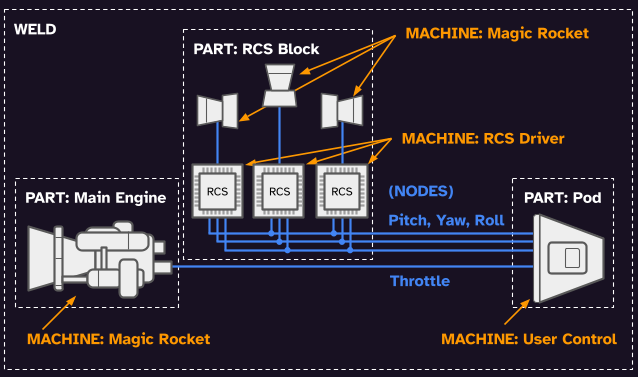

# Vehicles 101

This document describes vehicles in OSP.

## Introduction

Space vehicles are complicated: launch vehicles, artificial satellites, space planes, mechas, etc... Let's cut this up into different aspects:

* Parts
* Representation within a physics scene (activescene)
* Wiring, plumbing, structure, and other connections between parts. (Link system)

## ActiveScene representation: Parts, Welds, Prefabs

See `src/osp/activescene/vehicles.h`

'ActiveScene' represents physical objects as a tree of ActiveEnts. ActiveScene supports mass, inertia, shapes/colliders, etc...

`ACtxParts` (added by the `ftrParts` feature) adds support for parts.

ACtxParts introduces `PartId`s. Each PartId can be associated with a single ActiveEnt. ACtxParts also introduces `WeldId`s, which describes a group of parts. Each WeldId is associated with multiple PartIds.

'Welds' are intended to represent a single 'moving part'. For example, each segment of a robotic arm would be a separate Weld.

There is no 'VehicleId'. 'Vehicles' are just separate parts connected together through other means (Welds and/or Link system).

The ActiveEnt subtree representation of parts are created from loaded GLTF files, known as Prefabs. `ACtxPrefabs` allows associating Prefabs with ActiveEnts (and hence, PartIds).

### (Jolt) Physics engine integration

ActiveEnts are not automatically given physics. A separate feature needs to interface together Jolt and Vehicles (currently `ftrVehicleSpawnJolt`).

### Drawing the vehicle

Graphics-related code is 100% separated. This is great, because for a dedicated server or running in the background, graphics aren't needed, and the code should be out of the way.

Visual models and meshes were not mentioned above, as this isn't part of ActiveScene. This is currently handled by `ftrPrefabDraw`

## Link System: Machines, Ports, Nodes

A single part can have multiple rockets on it or even a gimbal or built-in fuel tank. These 'finer-grained' parts are referred to as Machines. Machines connect to each other exactly like electronic components, as Link system is originally based on the [Longeron++ circuits example](https://github.com/Capital-Asterisk/longeronpp/blob/main/examples/circuits).

Instead of just passing around booleans, OSP (currently only) supports passing around floats. Passing around plain data values is referred to as Signals (things named "sigFloat" and "SignalsFloat"). Different types of connections and propagation logic like fuel/fluid flow and structure is planned.

Machines don't directly connect to each other, and instead connect to 'Nodes' (term from electrical engineering). A Node-Machine connection is referred to as a Junction. For signals, Junctions can be inputs or outputs.

Machines are mostly stateless (besides their connections), and Nodes store state. To pass data around, a Machine can write to a node, and that notifies other connected Machines to update in a publisher-subscriber scheme.

Using framework, the Link feature interface (FILinks implemented by ftrParts) uses a nested loop block to repeatedly update Nodes and Machine as two major step (NodeUpd, MachUpd) until no more changes are detected. Practically, this is updating faster than the main physics loop; as in the real world, circuits run in nanosecond speeds. A signal must be able to propagate through thousands of logic gates within a single 1/60 second frame.

## Vehicle builder and spawning

From https://github.com/TheOpenSpaceProgram/osp-magnum/issues/306

Current implementation of how vehicles are built:
1. When testapp starts, it loads a known list of glTF files (in `src/testapp/main.cpp`), processing them into many 'Prefabs'.
    * `assigns_prefabs_tinygltf` looks at children of the root glTF node. Nodes with a name that starts with "part_" are processed into prefabs. Prefabs can have colliders, mass, and other physical properties beyond just being 3d models (set using name prefixes and glTF 'extras' properties). glTF files can contain multiple parts/prefabs; an individual prefab can be identified by a `PrefabPair`: a ResourceId for the glTF data and a PrefabId local to the resource.
2. When starting the `vehicles` test scene, the PrebuiltVehicles feature is loaded (in `vehicles_prebuilt.cpp`), it uses VehicleBuilder to create a 'VehicleData', specifying how to instantiate a vehicle.
    * VehicleData contains ...
      * Which prefabs to use (PrefabPairs) and their orientations.
      * Groups of prefabs/parts are structurally fixed together (called Welds). There's no 'tree of parts' (it's sort of a bad idea). There not being part to part structural connections is what this issue is about.
      * Machines, functional components like rockets. These have inputs and outputs like elements in a circuit simulator. (part of the 'link' system, docs needed :p)
      * Link/wire connections between machines.
    * VehicleBuilder is a little badly named as its not really 'building' a vehicle. "BlueprintVehicle" does happen to exist in the codebase, but its dead code from long ago.
3. Vehicles are spawned by adding a request to ACtxVehicleSpawn::spawnRequest (see `src/testapp/scenarios.cpp` for an example)
    * 'Vehicle spawn' (ftrVehicleSpawn) and 'Vehicle spawn using VehicleBuilder data' (ftrVehicleSpawnVBData) are separate features. This might be a bad idea, but it's to support multiple different ways to create vehicles or formats of vehicles in the future.
4. Vehicle-related features handle the request. Framework does the heavy lifting to orchestrate and make sure everything happens in the correct order:
    * VehicleSpawnVBData reads VehicleData of requested vehicle to spawn, then requests to spawn prefabs from the Prefabs feature. (see `src/adera_app/features/vehicles.cpp` and `src/adera_app/features/physics.cpp`)
    * Physics, drawing-related stuff, Machines, and everything else are eventually instantiated. Machine/part specific data is stored in ACtxParts (`src/osp/activescene/vehicles.h`).

## 'Point mass' representation when in orbit

TODO
